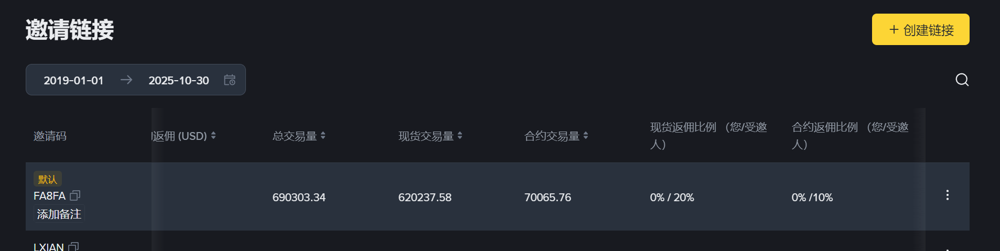

# PriceTrack
<b>币安alpha刷分插件</b>，半自动操作。 
根据网页上最新成交的价格，分别设置买入价=成交价+0.00000001、卖出价=成交价-0.00000001，并实时更新。 
买入和卖出都可以近乎0成本快速成交。 
帮助小散户跟踪上最新的价格，拉近与工作室之间的技术差距，降低交易成本。 
不在乎交易费的，可以在价格平稳时交易。想搏一搏的，可以在价格快速下跌后振荡的一段时间交易，一般还能赚零点几个U。 
<b>没钱的捧个人场，填个邀请码：</b> 
<b>FA8FA</b> 
已经设置成返还全部20%佣金 
 
<b>大佬们有钱的捧个钱场~</b> 
捐赠钱包地址： 
比特币 
1Pe3YC1yeZX1G5gsdTvYxuYvFUXDo6j8J6 
ETH（狐狸钱包） 
0x7D17291461b566f52c25b290e719e9E09768E965 
币安收款码 

